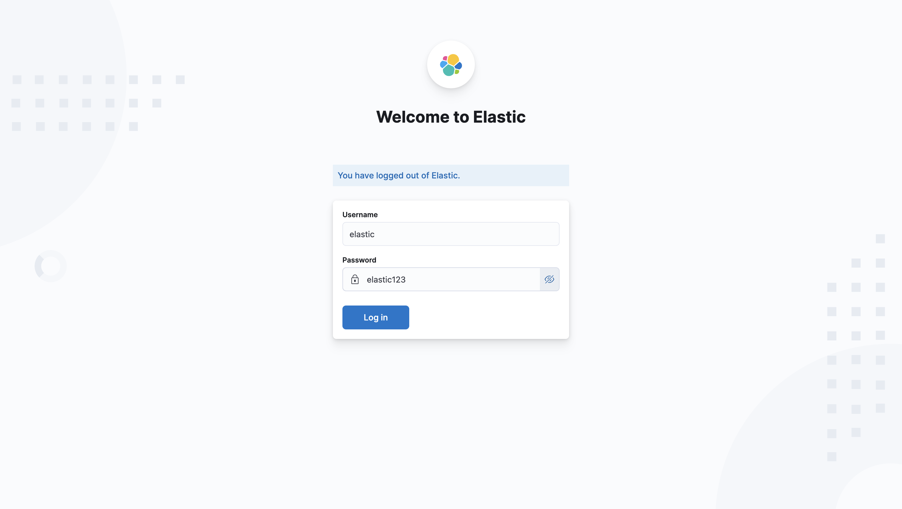

# Elastic Stack SIEM — Deployment Guide

Quick, aligned deployment guide using **Docker Compose v2**. For the full,
in-depth documentation (architecture, requirements, data flow) see
[`docs/`](./docs/README.md) — in particular [`docs/03-instalacion-y-montaje.md`](./docs/03-instalacion-y-montaje.md).

## Prerequisites

- Linux with Docker Engine 20.10+ and Docker Compose **v2** (`docker compose`)
- At least 4 GB RAM free for Docker
- Python 3.10+ (for the AI layer / dashboard)
- `openssl` (for certificates)

```bash
# Elasticsearch needs a high vm.max_map_count
sudo sysctl -w vm.max_map_count=262144
```

## Step 1 — Clone

```bash
git clone https://github.com/Amid68/Elastic-SIEM-Project.git
cd Elastic-SIEM-Project
```

## Step 2 — Configure environment

Copy the template and fill in real values (the real `.env` is gitignored):

```bash
cp .env.example .env
$EDITOR .env
```

Set strong values for `ELASTIC_PASSWORD` and `KIBANA_SYSTEM_PASSWORD`, and generate
the Kibana keys:

```bash
openssl rand -base64 32   # KIBANA_ENCRYPTION_KEY
openssl rand -base64 32   # KIBANA_SAVEDOBJECTS_KEY
```

`GEMINI_API_KEY` is **optional** — without it the AI analyst uses a deterministic
fallback.

> No more editing `docker-compose.yml` for `platform: linux/arm64` — those lines
> were removed; Docker selects the right architecture automatically.

## Step 3 — Generate TLS certificates

```bash
chmod +x generate_certs.sh
./generate_certs.sh

sudo chown -R 1000:1000 elasticsearch/certs/
sudo chmod 644 elasticsearch/certs/*.crt
sudo chmod 600 elasticsearch/certs/*.key
```

> Never commit certificates — they hold private keys (already in `.gitignore`).

## Step 4 — Deploy the stack

```bash
docker compose up -d
```

This starts, in dependency order:

1. **elasticsearch** — waits until healthy (the healthcheck is **authenticated**).
2. **setup** — one-shot service that sets the `kibana_system` password via the ES
   API, then exits. **You no longer reset passwords manually inside the container.**
3. **kibana**, **logstash**, **filebeat**.

## Step 5 — Verify

```bash
docker compose ps
docker compose logs setup        # expect: "kibana_system password set."
curl -s -u elastic:$ELASTIC_PASSWORD http://127.0.0.1:9200/_cluster/health
```

If Kibana shows authentication errors, re-check `KIBANA_SYSTEM_PASSWORD` in `.env`
and the `setup` logs.

## Step 6 — Access Kibana

Open **http://127.0.0.1:5601** (bound to localhost) and log in:

- Username: `elastic`
- Password: the `ELASTIC_PASSWORD` from your `.env`



## Step 7 — Run a scenario

Create the detection rule and run the brute-force simulation:
[Detecting a Brute-Force Attack](./brute_force.md).

For the AI analysis + supervision dashboard and the other attack types
(port scan, phishing), continue with [`docs/04-uso-y-ejecucion.md`](./docs/04-uso-y-ejecucion.md)
and [`docs/05-simulaciones-de-ataque.md`](./docs/05-simulaciones-de-ataque.md).

## Shut down

```bash
docker compose --profile simulation down     # stops everything incl. simulation
docker compose down -v                         # also removes the ES data volume
```
