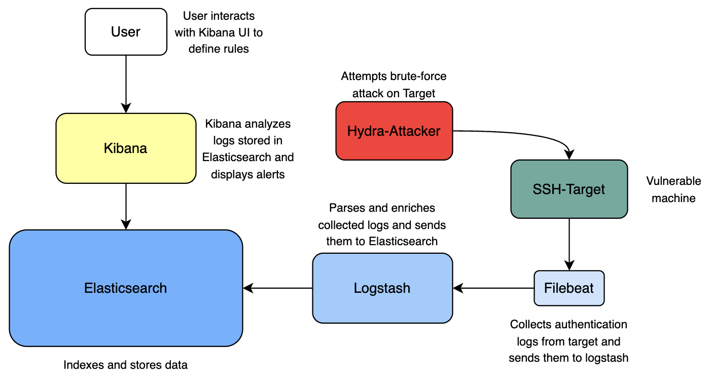
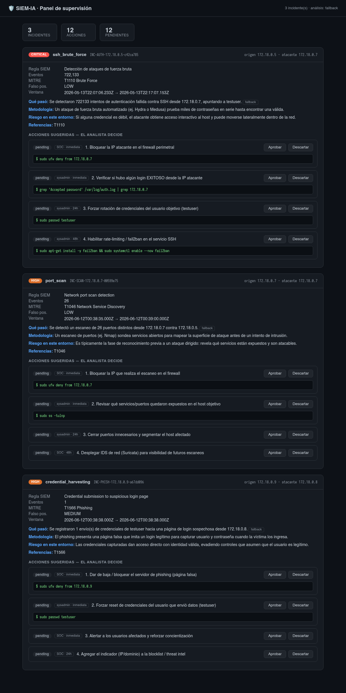
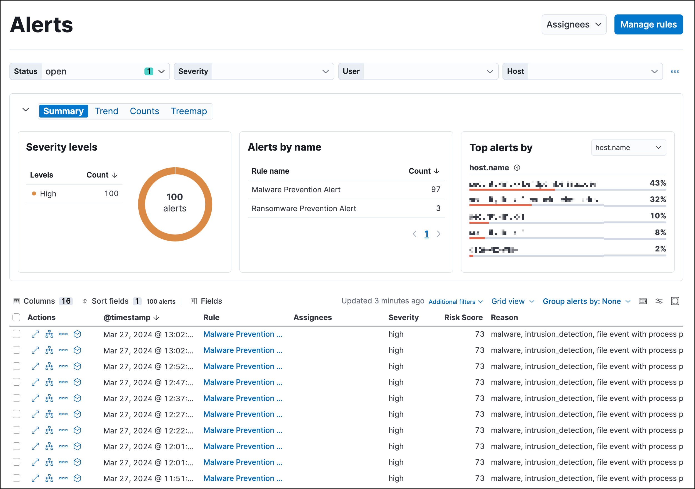
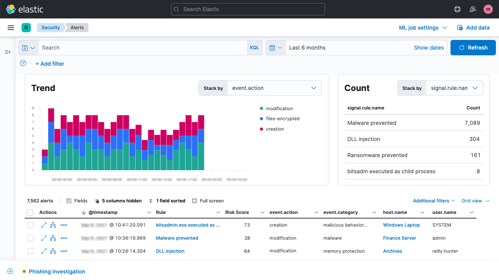
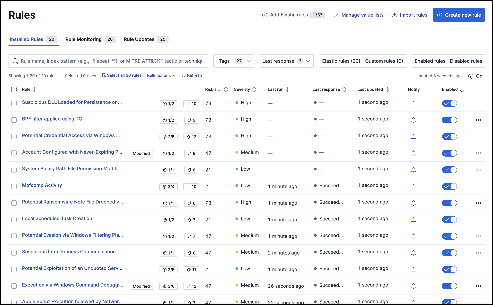

# Elastic SIEM Project

- **Ameed Othman 12220692 (CS)**
- **Ahmed Muwafi 12010640 (NIS)**
- **Motaz Saqqa 12113083 (NIS)**

This repository contains an Elastic Stack SIEM (Security Information and Event Management) solution **plus an AI analysis layer with a human-supervision dashboard**. Beyond collecting and detecting, the system classifies each incident, explains it in plain language, and lets a human analyst approve or dismiss the suggested response actions — *the AI suggests, the human decides*.

> 📚 **Full system documentation** (architecture, requirements, deployment, usage,
> attack simulations and end-to-end data flow) lives in [`docs/`](./docs/README.md).



*Figure 1: Topology of the Elastic SIEM Project*

## What is the Elastic Stack?

The Elastic Stack (formerly known as the ELK Stack) is a collection of open-source projects that together provide a powerful platform for security analytics:

- **Elasticsearch**: A distributed, RESTful search and analytics engine capable of storing and analyzing large volumes of data in near real-time.
- **Logstash**: A server-side data processing pipeline that ingests, transforms, and enriches data from multiple sources simultaneously.
- **Kibana**: A visualization tool that provides charts, graphs, and dashboards for data stored in Elasticsearch.
- **Beats**: Lightweight data shippers that send data from edge machines to Logstash or Elasticsearch.


*Figure 2: Architecture of the Elastic Stack showing data flow between components*

## Components Used in This Project

### Core Components

1. **Elasticsearch (v8.12.2)**
   - Serves as the central data store for all security events and logs
   - Provides the search and analytics capabilities
   - Configured with security features enabled for authentication and authorization
   - Uses TLS/SSL for secure communications

2. **Kibana (v8.12.2)**
   - Provides the visualization interface for log and event data
   - Hosts the Security Solution (SIEM) application for threat detection and response
   - Allows creation of custom dashboards for security monitoring
   - Enables configuration of detection rules for security events

3. **Logstash (v8.12.2)**
   - Processes logs and events from various sources
   - Contains specialized filters for security event processing
   - Enriches security data with GeoIP information
   - Tags authentication events for easier analysis

4. **Filebeat (v8.12.2)**
   - Collects logs from Docker containers and system files
   - Monitors specific log files for security events
   - Ships logs to Logstash for processing
   - Adds metadata to events for better contextual information

### Simulation Components

For testing and demonstration purposes, this project includes attack simulations
for **three attack types** (see [`docs/05-simulaciones-de-ataque.md`](./docs/05-simulaciones-de-ataque.md)).
The attacker/target containers live behind a Docker Compose **`simulation` profile**,
so they do not start by default:

```bash
docker compose --profile simulation up -d
```

1. **SSH Target** (`ssh-target`) — containerized SSH server, the victim of the brute-force attack.
2. **Hydra Attacker** (`hydra-attacker`) — Hydra + nmap, used for brute-force and port-scan simulations.

The simulations are:

| Attack | Script | MITRE |
|--------|--------|-------|
| SSH Brute Force | `simulation/run-brute-force.sh` | T1110 |
| Port Scan | `simulation/run-port-scan.sh` | T1046 |
| Phishing / credential capture | `simulation/run-phishing.sh` | T1566 |

Port-scan and phishing scripts also support `--offline` (generate detectable logs
without Docker).

### AI Analysis Layer & Human-Supervision Dashboard

On top of the SIEM, a Python layer turns raw alerts into supervised decisions:

1. **`prepare-for-ia.py`** — extracts and cleans alerts + auth logs from Elasticsearch.
2. **`classifier.py`** (Agent 1, deterministic) — rules/thresholds classify each incident and attach a fixed action playbook.
3. **`siem_agent.py`** (Agent 2, LLM + fallback) — explains the incident in plain language; works offline via a deterministic fallback if no LLM is available.
4. **`dashboard.py`** (Flask) — the analyst approves/dismisses each suggested action; every decision is written to an **append-only** log (`decisions.jsonl`).

Run it all with `python3 siem_pipeline.py`, then `python3 dashboard.py`
(http://127.0.0.1:5000). Details in [`docs/04-uso-y-ejecucion.md`](./docs/04-uso-y-ejecucion.md).



*Figure: human-supervision dashboard showing the three detected attack types.*

## Security Features

The Elastic Stack deployment in this project includes several security features:

- Authentication using built-in users and roles
- TLS/SSL encryption for data in transit
- Detection rules for common security threats
- GeoIP enrichment for network traffic analysis
- Alert generation for security events



*Figure 3: Security features implemented in the Elastic Stack SIEM*

## Directory Structure

**SIEM stack**
- `docker-compose.yml`: Main Docker Compose file (Elastic stack + `setup` service + `simulation` profile)
- `elasticsearch/`, `kibana/`, `logstash/`, `filebeat/`: per-service configuration
- `.env` / `.env.example`: environment variables (real `.env` is gitignored)
- `generate_certs.sh`: generates the TLS certificates
- `simulation/`: attack simulation scripts (brute force, port scan, phishing)
- `network_logs/`: drop point for network/web events (Filebeat input + offline detection source)

**AI layer & dashboard**
- `siem_lib.py`: shared module (ES access, queries, sanitization, file utils)
- `prepare-for-ia.py`, `classifier.py`, `siem_agent.py`: extract → classify → analyze
- `siem_pipeline.py`: one-command orchestrator
- `dashboard.py` + `templates/`: human-supervision GUI (Flask)
- `requirements.txt`: Python dependencies

**Documentation**
- `docs/`: architecture, requirements, deployment, usage, simulations, data flow
- `DEPLOYMENT.md`, `brute_force.md`: deployment guide and brute-force walkthrough

## Deployment Instructions

Detailed step-by-step instructions for deploying the Elastic Stack SIEM solution are provided in the [Deployment Guide](./DEPLOYMENT.md).

## SIEM Dashboard

Once deployed, the Elastic SIEM provides comprehensive security monitoring capabilities through its intuitive dashboard interface.



*Figure 4: Elastic SIEM dashboard showing security events and alerts*

## Detection Rules

The SIEM solution uses detection rules to identify potential security threats and generate alerts.



*Figure 5: Configuration of detection rules in Kibana*

## Security Scenarios

This project includes walkthroughs for common security scenarios:

1. [Detecting Brute Force Attacks](./brute_force.md): SSH brute force (T1110)
2. [Attack simulations guide](./docs/05-simulaciones-de-ataque.md): brute force, port scan (T1046) and phishing (T1566), each detected end-to-end and surfaced in the supervision dashboard.
